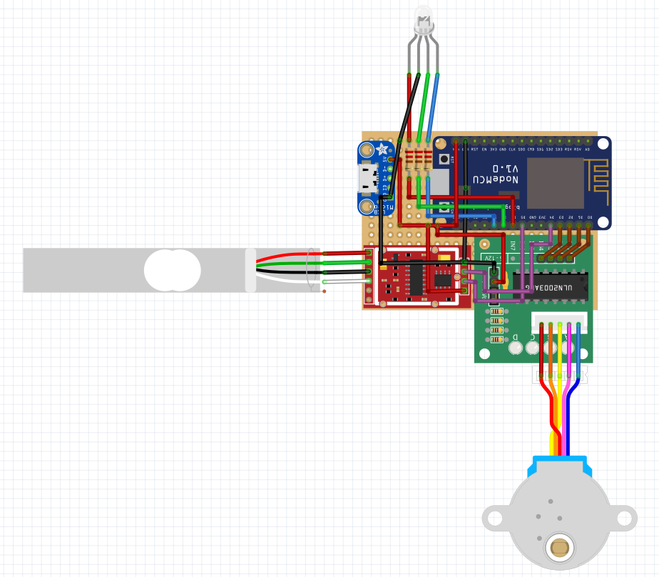

# Palola - Arduino 🐶⚙️

> Programação do dispositivo dispensador automático de ração: Palola.

## Materiais utilizados 📦
- Módulo WiFi Serial ESP8266 ESP-01 (NodeMCU)
- Célula De Carga Fina 1Kg
- Módulo Conversor 24bit Hx711
- Motor De Passo + Módulo De Controle (driver Uln2003)
- Led RGB Difuso 5mm - Catodo Comum
- Fonte 5V 2A
- Buzzer passivo
- Módulo Adaptador Micro USB Fêmea para DIP

## Esquema elétrico 📐

## Licença 📄
Este projeto está sob a licença [Creative Commons Attribution-NonCommercial-NoDerivatives 4.0 International Public License](https://creativecommons.org/licenses/by-nc-nd/4.0/).